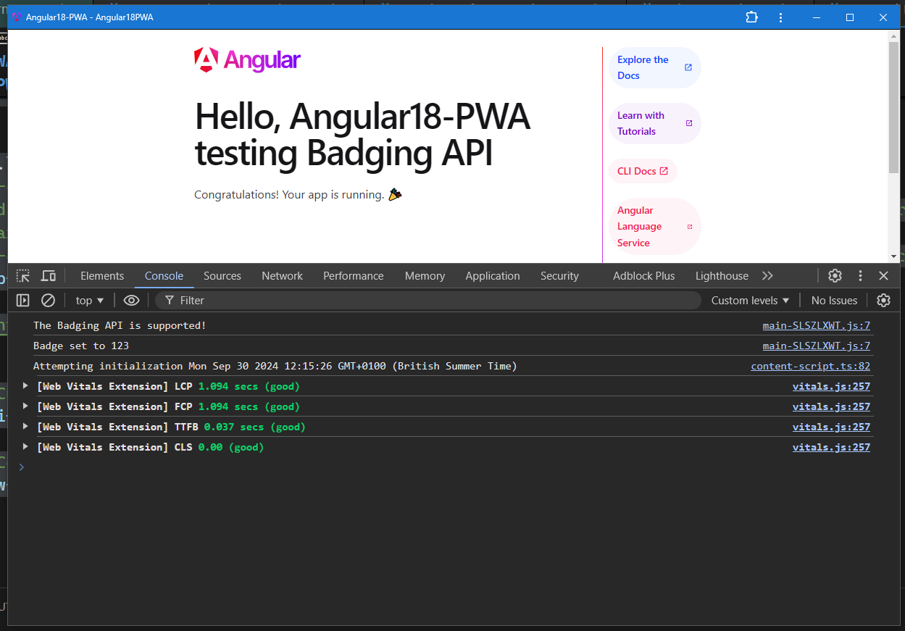

# Angular18 PWA - Testing Badging API

> Testing the Badging API involves checking how well our application interacts with the API, specifically for managing badges (like notifications) on a user’s device.

> The App Badging API is a new web platform API that allows installed web apps to set an application-wide badge, shown in an operating-system-specific place associated with the application (such as the shelf or home screen).

> `Note`: In order for this demo to work, it must be an installed Progressive Web App. It also requires the Notifications permission on some platforms

```js
ng new Angular18-PWA --routing --style=scss
cd Angular18-PWA

// This will configure the service worker for caching assets,
// manifest.webmanifest file, and icons needed to make our Angular app a PWA
ng add @angular/pwa

// Testing PWA Features
// PWAs rely on service workers and specific configurations that need to be served over HTTPS or a localhost domain
// angular-cli (ng-serve) does not work with service workers
npm i -g http-server

// Serve the Application Locally
// Output location: C:\Users\lanes\dev2\Angular18-PWA\dist\angular18-pwa
ng build --configuration production


Initial chunk files   | Names         |  Raw size | Estimated transfer size
main-FAAMPFZY.js      | main          | 215.72 kB |                58.12 kB
polyfills-FFHMD2TL.js | polyfills     |  34.52 kB |                11.28 kB
styles-5INURTSO.css   | styles        |   0 bytes |                 0 bytes
                      | Initial total | 250.24 kB |                69.40 kB


cd .\dist\angular18-pwa\browser
// -c-1  to disable caching for debugging
// disabling caching ensures that any changes you make to our files (like HTML, CSS, or JavaScript)
// are reflected immediately in the browser without needing to refresh or clear the cache.
// -c10 for 10 seconds: when you're closer to deployment or when performance testing our App
http-server -o -p 8081 -c-1

// Customise Our PWA
manifest.webmanifest

// Configuring Service Worker Behavior
ngsw-config.json
```


## What to Expect

When the component initialises, you should see one of the following messages in the console:

"The Badging API is supported!" if the API is available.
"The Badging API is not supported in this browser." if it is not.
If the badge is successfully set to 123, you should see: "Badge set to 123" in the console.



## Summary of Key Indicators for a Well-Functioning PWA


- Service Worker: Must be active for caching and offline capabilities.
- Manifest: Properly configured for installability and native-like behavior.
- Cache Storage: Efficient use of cache for offline functionality.
- IndexedDB: Persistent storage of dynamic data.
- Installability: Confirmed installable status and ready for user engagement.

---

This project was generated with [Angular CLI](https://github.com/angular/angular-cli) version 18.0.3.

## Development server

Run `ng serve` for a dev server. Navigate to `http://localhost:4200/`. The application will automatically reload if you change any of the source files.

## Code scaffolding

Run `ng generate component component-name` to generate a new component. You can also use `ng generate directive|pipe|service|class|guard|interface|enum|module`.

## Build

Run `ng build` to build the project. The build artifacts will be stored in the `dist/` directory.

## Running unit tests

Run `ng test` to execute the unit tests via [Karma](https://karma-runner.github.io).

## Running end-to-end tests

Run `ng e2e` to execute the end-to-end tests via a platform of our choice. To use this command, you need to first add a package that implements end-to-end testing capabilities.

## Further help

To get more help on the Angular CLI use `ng help` or go check out the [Angular CLI Overview and Command Reference](https://angular.dev/tools/cli) page.

---

### :100: <i>Thanks!</i>

#### Now, don't be an stranger. Let's stay in touch!

<a href="https://github.com/leolanese" target="_blank" rel="noopener noreferrer">
  
</a>

##### :radio_button: gitroll: <a href="https://gitroll.io/profile/uCOZ9SM8b7ne9h17NuPuKVky9uFh2" target="_blank">LeoLanese</a>

##### :radio_button: Linkedin: <a href="https://www.linkedin.com/in/leolanese/" target="_blank">LeoLanese</a>

##### :radio_button: Twitter: <a href="https://twitter.com/LeoLanese" target="_blank">@LeoLanese</a>

##### :radio_button: Portfolio: <a href="https://www.leolanese.com" target="_blank">www.leolanese.com</a>

##### :radio_button: DEV.to: <a href="https://www.dev.to/leolanese" target="_blank">dev.to/leolanese</a>

##### :radio_button: Blog: <a href="https://www.leolanese.com/blog" target="_blank">leolanese.com/blog</a>

##### :radio_button: Questions / Suggestion / Recommendation: developer@leolanese.com
